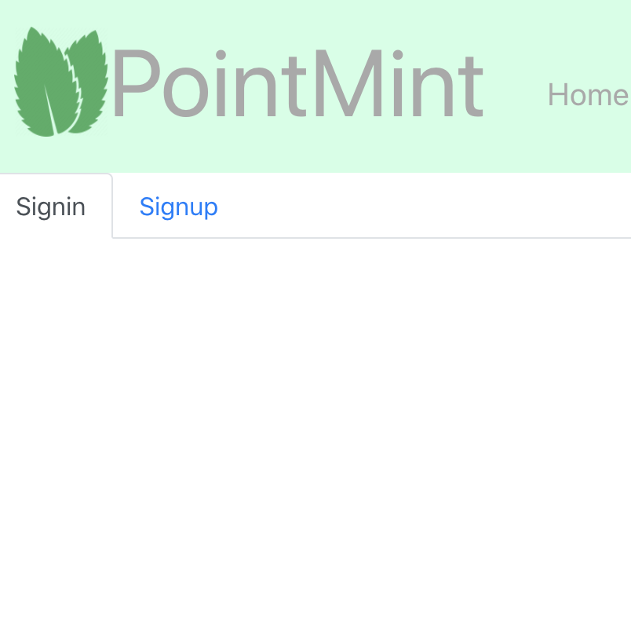

# Project 3 - PointMint
Project for UofO Full Stack Web Development Bootcamp

## Overview
This application represents our third team project of the course, and uses MERN to create a user facing appointment scheduling tool, with administrative controls.

## Technologies
* [Node.js](https://nodejs.org/en/)
* [React](https://reactjs.org/)
* [Express](https://expressjs.com/)
* [MongoDB](https://www.mongodb.com/)
* [Mongoose](https://mongoosejs.com/)
* [Heroku](https://www.heroku.com/)
* [Axios](https://www.npmjs.com/package/axios)
* [React Bootstrap](https://react-bootstrap.github.io/)
* [JWT](https://jwt.io/)

## Credit
Tetsuya Hasegawa - [JWT Auth Example](https://github.com/Tetsuya3850/React-Express-Examples/tree/master/auth)

## Links
Here is a link to our [application](https://point-mint.herokuapp.com/) and project [presentation](client/public/assets/PointMint.pdf)

[Lauren Doss](https://github.com/laurendoss), [Corey Walker](https://github.com/cwalker226), and [Dylan Hulbert](https://github.com/dylanhulbert)

